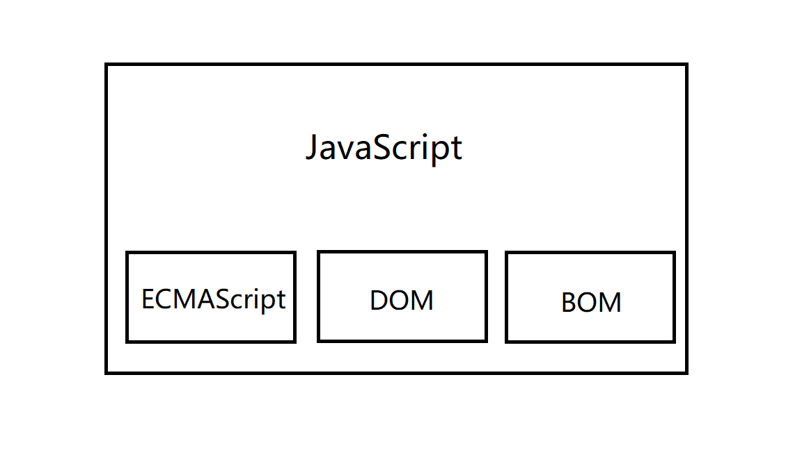

# 1. JavaScript 基础

## 1.1 发展历史及其组成部分

### 1.1.1发展历史

* 1992 网景公司 Bredan Eich 开发
* 1997 欧洲计算机制造商协会 统一 JavaScript, JScript(微软)， ECMAScript (总规范) 称为  `JavaScrpit`

### 1.1.2.组成部分




* **ECMAScript** : 定义了基本的语法和对象
* **DOM (Document Object Model)** : 文档对象模型 ，是 HTML 和 ＸＭＬ 文档 的应用程序 编程接口 。DOM 把网页构成 由节点级构成的文档， 用 DOM 可以删 添 替换 文档节点
* **BOM (Bowser Object MOdel)** : 浏览器对象模型，描述与浏览器窗口 进行访问和操作的 方法 和 接口


## 1.2  JavaScrpit 与 Java 的关系  以及 编辑工具

### 1.2.1. JavaScrpit 与 Java 的关系

* **没有关系**
* JavaScrpit 由浏览器执行， Java 程序编译执行
* JavaScrpit 是 脚本语言，Java 是 面向对象语言
* JavaScrpit 弱类型语言，  变量 不用 声明，Javat 强类型语言，  变量 必须 声明

### 1.2.2.编辑工具

* 任意文本编辑器

## 1.3 JavaScript 的特点

1.  解释性语言，不需要编译，在浏览器中运行时解释
2. 基于事件驱动的动态语言， 不需要web 服务器就可以对用户的输入进行响应
3. 依赖于浏览器，与操作系统无关
4. 安全，不允许访问本地硬盘，不能将数据存入服务器，不允许对网络文档进行修改
5. 基于对象，很多功能可以来自脚本环境中对象的方法与脚本互动


## 1.4  JavaScript 的 语法特点

1. 区分大小写

2. 语句分号结束

   `return` `break` `contiune` 换行自动 加分号


## 1.5 JavaScript 的 代码执行顺序

* JavaScript 的代码执行机制

  1. 事件处理代码

     ​	HTML 文件内容载入完成，---->非事件处理代码完成  ----> 事件处理代码

  2. 非事件处理代码

     ​	HTML 文件内容载入完成，JavaScript 文档出现的顺序，从上到下依次执行


# 2.JavaScript 的调试方法

## 2.1 alert() 调试

```
alert(msg);
windows.alert(msg)
```

案例

```html
<!DOCTYPE html>
<html lang="en">

<head>
    <meta charset="UTF-8">
    <meta http-equiv="X-UA-Compatible" content="IE=edge">
    <meta name="viewport" content="width=device-width, initial-scale=1.0">
    <title>使用alert()调试代码</title>
    <!-- script -->
    <script>
        var sum = 0,
            i = 1;
        while (sum < 20) {
            sum += 1;
            alert("sum = " + sum); // 跟踪 sum 变量的值
            alert("i = " + i); // 跟踪 sum 变量的值
            i++;
        }
    </script>

</head>

<body>
    累计结果：
    <input id="val" type="text">

    <script>
        alert("111"); // 定位错误

        var oText = document.getElementById("val")
        alert("222"); // 定位错误
        oText.value = sum;
    </script>

</body>

</html>
```


* `alert()` 会阻断程序的运行

## 2.2 console.log() 调试代码

案例

```html
<!DOCTYPE html>
<html lang="en">

<head>
    <meta charset="UTF-8">
    <meta http-equiv="X-UA-Compatible" content="IE=edge">
    <meta name="viewport" content="width=device-width, initial-scale=1.0">
    <title>使用console.log()调试代码</title>
    <!-- script -->
    <script>
        //  变量 sum = 0, i = 1
        var sum = 0,
            i = 1;

        while (sum < 20) {
            sum += 1;
            console.log("sum = " + sum); // 跟踪 sum 变量的值
            console.log("i = " + i); // 跟踪 sum 变量的值
            i++;
        }
    </script>

</head>

<body>

</body>

</html>
```

* **实现**

